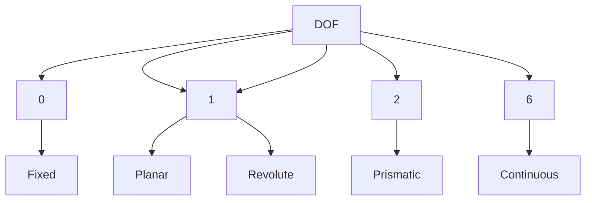

# ROS
ROS cheetsheet, tips, diagrams, ...

## URDF

```mermaid

graph TD;
    URDF-->Joint;
    Joint-->Planar-->Rotate;
    Planar-->DOF=1;  
    Joint-->Floating-->DOF=6;
    Joint-->Floating-->Wrist;
    Joint-->Prismatic-->Slides;
    Prismatic-->Translate;
    Prismatic-->Rotate;
    Prismatic-->Upper_Bound;
    Prismatic-->Lower_Bound;
    Prismatic-->DOF=2
    Joint-->Continuous-->Rotate-->No_Bounds;
    Joint-->Revolute-->Upper_Bounds;
    Continuous-->DOF=1;
    Continuous-->Wheel;
    Revolute-->Lower_Bounds;
    Revolute-->DOF=1;
    Joint-->Fixed-->Doesn't_Move;
```

```mermaid

graph TD;
    DOF=1-->
    Joint-->Planar-->Rotate;
    Planar-->DOF=1;
    Joint-->Floating-->DOF=6;
    Joint-->Prismatic-->Slides;
    Prismatic-->Upper_Bound;
    Prismatic-->Lower_Bound;
    Prismatic-->DOF=2
    Joint-->Continuous-->Wheel-->No_Bounds;
    Joint-->Revolute-->Upper_Bounds;
    Revolute-->Lower_Bounds;
    Joint-->Fixed-->Doesn't_Move;
```


